# Ref — the screens, for review

Every screen of the app, rendered from the real SwiftUI in simulators with fixed
data — the `render` job of `.github/workflows/ref.yml`, screenshotted on demand.

**These are snapshots, replaced in place, not history.** Re-dispatch the render
job (`Actions → ref → Run workflow → render`) after a UI change and copy the
artifact over this folder. Nothing here has been installed anywhere yet.

## On the watch

| Start | Live match | Record |
|---|---|---|
| 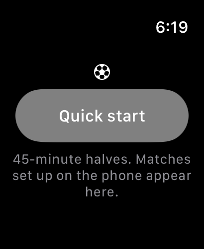 | 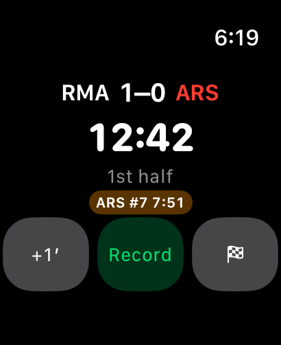 | 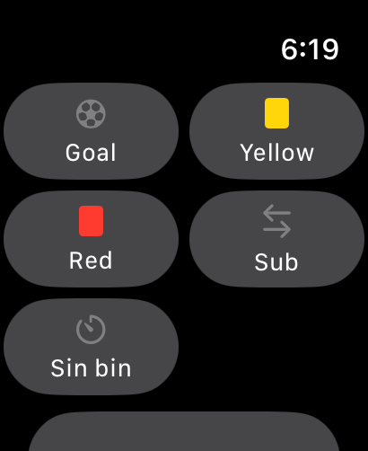 |

| Half time | Full time |
|---|---|
| 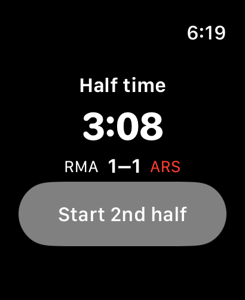 | 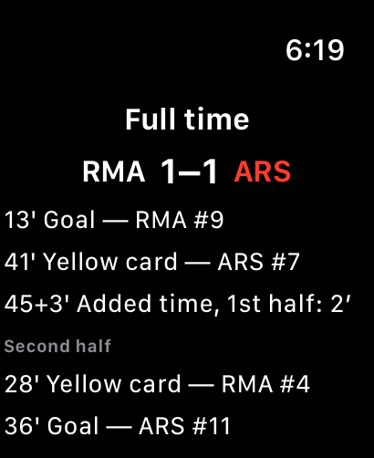 |

## On the phone

| Matches | New match | Match report |
|---|---|---|
| 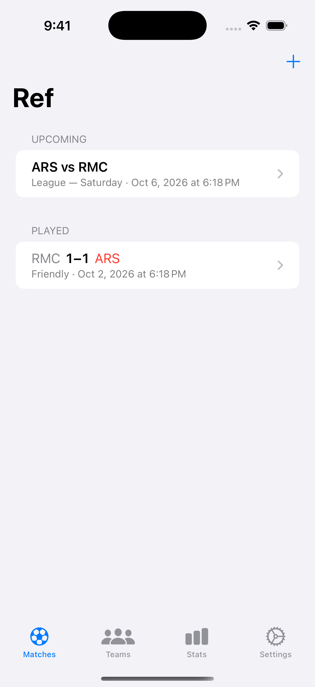 | 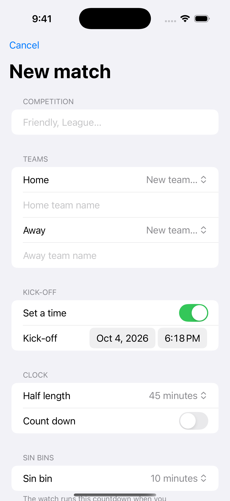 | 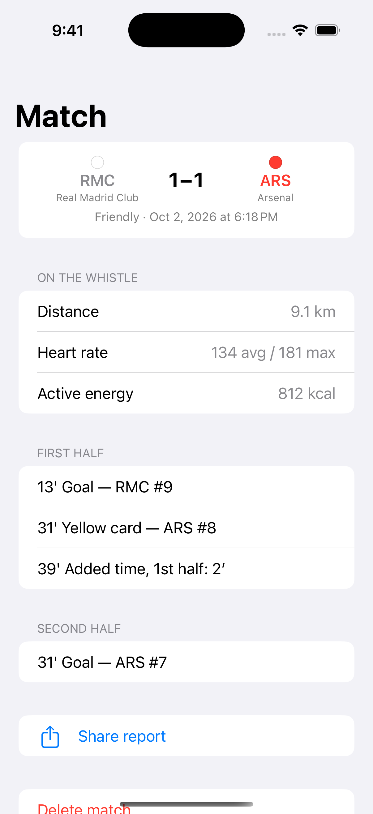 |

| Teams | Stats | Settings |
|---|---|---|
| 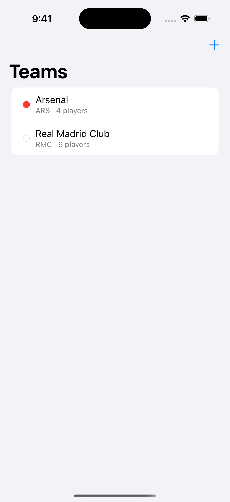 | 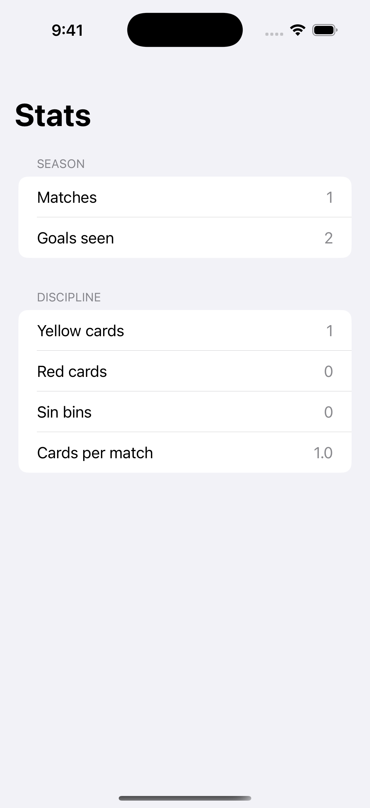 | 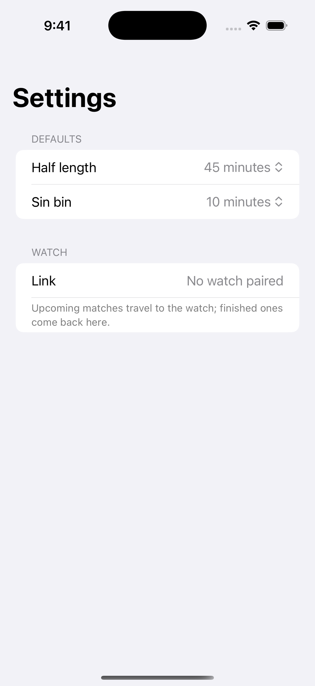 |

## Where this actually stands (2026-10-04)

- The engine's 41 tests run on the build box and in CI on every push.
- The watch app and the phone app compile with Swift 6 strict concurrency, and
  the build job asserts the paired-bundle shape a *companion* watch app needs.
- Not yet done: the first signed build (three website errands — the App Store
  Connect API key, the app record for `com.brisaloca.ref`, the HealthKit
  capability; all in `SCOPE.md`), and the first real match, which is the only
  test that counts.
